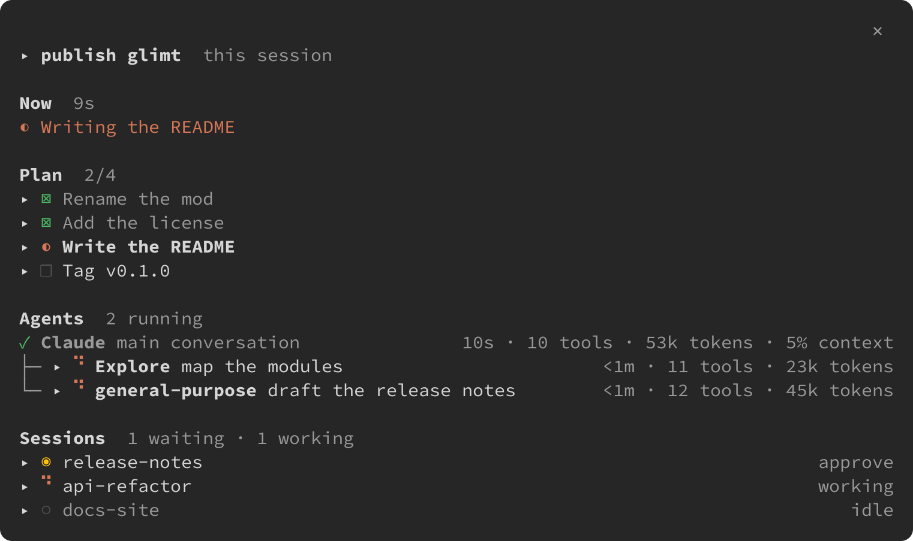

<h1>
  <picture>
    <source media="(prefers-color-scheme: dark)" srcset="docs/logo-dark.svg">
    
  </picture>
</h1>

A quiet side pane for Claude Code: what this session is doing, its plan, its agents, and every other session.

_glimt_ is Danish for a glimpse, a brief flash of light. Say it like _glimpse_ without the _-pse_: GLIMT, with a short _i_.

Its icon says what it does: everything stays in line; the one that needs you steps out.



## Install

```
/plugin install glimt --marketplace mmedum/glimt
```

Needs Claude Code 2.1.289 or later in a terminal (2.1.295 for desktop notifications); tested with 2.1.295. Mods don't draw in the VS Code panel or with `-p`.

The pane opens by itself when the terminal is at least 144 columns wide. `/glimt` opens it at any width, with the keyboard.

Third-party marketplaces don't update on their own. To update, run `claude plugin update glimt@glimt` and restart Claude Code.

## Keys

The keys work while the pane holds the keyboard: open it with `/glimt`, click it, or press ctrl+x tab. As in Neovim's side panels, glimt binds only its own actions and leaves moving to Claude Code: ↑ ↓ and Tab move between rows, Enter opens or closes the row (a step's description, an agent's task, a session's agents), and Esc gives the keyboard back to the prompt. The key row shows only what the selected row allows; `i` lists every key.

| Key | Does                                                                     |
| --- | ------------------------------------------------------------------------ |
| `l` | go into an agent or a session: its task, model, branch and live activity |
| `h` | back out, one level at a time, from the line that names where it goes    |
| `n` | new agent here                                                           |
| `s` | new background session (`claude --bg`), from the `i` list                |
| `r` | rename this session, or another session running glimt                    |
| `c` | clear this conversation, after asking                                    |
| `m` | write to the agent or session you are in                                 |
| `a` | copy a background session's `claude attach` command                      |
| `x` | stop a background session or agent, after asking                         |
| `i` | all keys                                                                 |
| `q` | close the pane, from the `i` list                                        |

A spinner marks whatever is working right now: a running agent, a working session, the step in progress while Claude is on it. The rest keep still marks: `◉` waiting for you, `○` idle, `✓` done, `✗` failed, `■` stopped.

Under this session's name, a status row speaks up only when something is out of the ordinary: `bypass permissions` in amber while the main conversation runs in that mode; a plan limit from 80% used, at full weight from 95%, the fullest first with when it resets, as in `5h limit 95% · resets in 1h12m`; and `same folder` when another session runs in this session's folder. Otherwise it isn't there. Open the row for the folder, the model and its effort.

A waiting session says what it wants: `approve` for a permission prompt, `answer` for a question. A background session that ended says `done`, `failed` or `stopped`. Each other session shows how long it has been in its state, counted from when glimt saw that state begin, and its name turns bold when it stops, until you open it. A session you never renamed goes by the title Claude Code gave it, as in its resume list. A row says `same folder` when another session runs in the same folder. Where another session runs glimt, its row also shows how far its plan has come, as in `3/7`, `bypass` in amber while it runs in bypass permissions, and its context from 80% full. Going into a session names its permission mode.

When a background session starts waiting for you, finishes or fails, glimt sends a notification. With glimt open in several terminals, only one of them does. Turn them off with glimt's Notifications option: `/plugin configure glimt@glimt` in Claude Code, then restart it.

An agent with a call waiting for your approval shows `◉` and `approve` with the tool and what it runs, as in `approve Bash · git push`. Claude Code tells a mod when a call is put to you, not when you answer, so the mark stays until that call ends.

## How it works

Mods run with your permissions, so here is everything glimt touches. `claude plugin validate` lists the same. glimt itself makes no network requests; an agent or a session you start with it talks to Claude like any other.

**What it reads**

- This session's tool calls, tasks, subagents and turns, through the mod API, and the messages of one of its agents while you are inside it.
- This session's permission mode, from the hook events that carry it, and its plan limits, from Claude Code's usage measurements.
- Claude Code's own list of this session's agents (`$.agent.list`), every 5 seconds while glimt shows one as running, so an agent whose end it missed doesn't stay running.
- The sessions on this machine and their state, from `claude agents --json`, every 5 seconds while the pane is drawn.
- Each listed session's transcript under `~/.claude/projects/`, for the title Claude Code gave it: once, whether the session was ever renamed, and while it never was, the transcript's last 64 KiB every 30 seconds while the pane is drawn.
- Under `~/.claude/projects/` (or `$CLAUDE_CONFIG_DIR/projects/`), for a session you open: its subagents' file names and `.meta.json` files every 5 seconds, its transcript's last 128 KiB every 2 seconds while you are inside it, and an agent's first line when you open that agent.
- The environment variables `HOME` and `CLAUDE_CONFIG_DIR`, only to find that folder and to write paths as `~`. It reads no credentials.

**What it runs**

- These programs, and no others: `claude agents --json`; `tail -c 131072 <transcript>` and `head -n 1 <agent transcript>` for the reads above; `grep -m 1 -F '"type":"custom-title"' <transcript>` and `tail -c 65536 <transcript>` for a session's title; `claude --bg <task>`, in this session's folder, when you press `s` and type a task; `claude stop <id>` when you press `x` on a background session and answer `y`; `git -C <folder> rev-parse --abbrev-ref HEAD` for a session you are inside, at most every 30 seconds, to show its branch.
- Three of Claude Code's task tools: `TaskList` once at session start, so a resumed session shows its plan, and `TaskGet` when you open a step, for its description, which only read; and `TaskStop` when you press `x` on an agent that runs in the background and answer `y`, which stops that agent.
- Two slash commands: `/rename <name>` when you rename this session with `r`, or when another session's glimt asks it to take a name; `/clear` when you press `c` and answer `y`.
- A `general-purpose` agent when you press `n`. Its prompt is the task you type, and nothing else.

**What it writes**

- A message you type with `m`, as typed, to the agent or session you are inside, through Claude Code.
- Claude Code's plugin store, which only glimt in the other sessions on this machine reads: this session's running agents (type, description, task, start time, the tool each runs and how many it has run, and the tool one waits on you to allow), how far its plan has come, its permission mode, how full its context is, and names asked of other sessions.
- When a background session starts waiting for you, finishes or fails, one notification through `$.ui.notify`, Claude Code's own call (2.1.295), and your notification setting; a toast where your terminal shows none; nothing if you turned notifications off in Claude Code or glimt's Notifications option is off. A session in a terminal of its own notifies from there when it waits.
- `claude attach <id>` to your clipboard when you press `a`.

**What its hooks change**

- The system prompt: while Claude has the task tools, one sentence asking it to file sub-steps under their step (`metadata.parent`).
- The chat, while the pane is open: task-list rows are left out, and a running agent's row is kept to one line.
- `/glimt`, its own command, opens the pane.

Its hook on Claude Code's permission request only notes which agent is being asked and about which call (the tool, and the command, path or address it is on), and hands the request on unchanged: glimt never answers a permission. Its other hooks (tool calls, turns, agents, prompts, the hook events that carry the permission mode, usage measurements, session start and end, focus) only read what passes, to keep the pane current, and pass it on unchanged.

The plan comes from Claude's task list. Claude Code offers that list by default only on some models, and on every model in background sessions (agent view, or `claude --bg`); see [task tool availability](https://code.claude.com/docs/en/tools-reference#task-tool-availability). To have it in a terminal session on other models, start Claude Code with `CLAUDE_CODE_ENABLE_TODO_TOOLS=1`. Without it, the plan says so and everything else works the same.

It can't switch this terminal to another session: Claude Code offers mods no way to do that ([#100519](https://github.com/anthropics/claude-code/issues/100519)). In an attached background session, ← on an empty prompt returns to agent view.

## Privacy

glimt collects no data about you and sends nothing anywhere. It runs only on your machine, makes no network requests, and has no service or telemetry of its own. It writes no files.

What it reads, it reads to draw the pane, as listed under [How it works](#how-it-works). What it keeps between sessions sits in Claude Code's plugin store on your machine: each session's running agents, with up to 400 characters of each agent's task and the tool one waits on you to allow, how far its plan has come, its permission mode and how full its context is, and names one session asks another to take. A session's entry is deleted when the session ends or stops running, an entry not refreshed for a minute is ignored, and a name is deleted once taken.

An agent or a session you start from glimt, and a message you send with `m`, goes to Claude through Claude Code like anything you type yourself, under [Anthropic's privacy policy](https://www.anthropic.com/legal/privacy).

## Contributing

Questions and bugs: [open an issue](https://github.com/mmedum/glimt/issues). For a pull request, open an issue first.

Run the tests with `claude plugin test .` and check the manifests with `claude plugin validate --strict .`. Format with `npx oxfmt` and lint with `npx -p oxlint -p oxlint-tsgolint oxlint --type-aware hooks tests`; CI pins the versions. Claude Code writes the API types into `.claude-plugin/types/` when an interactive session loads the mod from its folder (`claude --plugin-dir .`); after that, `tsc -p .` type-checks it. CI gets the same types another way; see `.github/workflows/ci.yml`.

To release: bump `version` in `.claude-plugin/plugin.json` (installed copies only update when it changes), add the version's section to `CHANGELOG.md`, then tag `vX.Y.Z` and publish a GitHub Release with that section.

## License

[Apache-2.0](LICENSE) © 2026 Mark Medum Bundgaard
